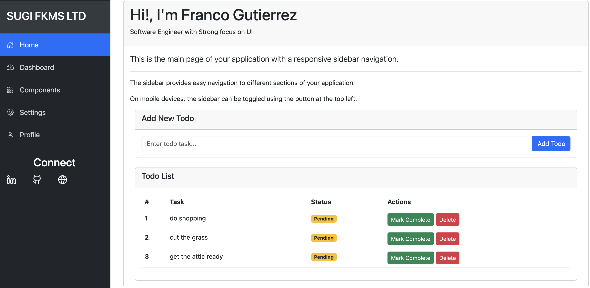

# SugiSchema - Flask Todo & Image Classification App

A comprehensive Flask web application that combines todo list management with AI-powered image classification capabilities. With a admin dashboard with a list of custom components such as form builder, data table, alert system and others.



## Features

### Todo Management
- ✅ Add new todo items
- ✅ Mark todos as complete/incomplete
- ✅ Delete todo items
- ✅ RESTful API endpoints
- ✅ Responsive web interface

### Image Classification
- 🔍 AI-powered image classification (Bird vs Frog)
- 📤 File upload support (PNG, JPG, JPEG)
- 🤖 PyTorch CNN model integration
- 📊 Real-time predictions via API

## Tech Stack

- **Backend**: Flask (Python web framework)
- **AI/ML**: PyTorch, Torchvision
- **Image Processing**: Pillow (PIL)
- **Frontend**: HTML, CSS, JavaScript
- **CORS**: Flask-CORS for cross-origin requests
- **Serialization**: Marshmallow

## Installation

### Prerequisites
- Python 3.7+
- pip package manager

### Setup

1. **Clone the repository**
   ```bash
   git clone <repository-url>
   cd sugischema
   ```

2. **Create virtual environment (recommended)**
   ```bash
   python3 -m venv venv
   source venv/bin/activate  # On Windows: venv\Scripts\activate
   ```

3. **Install dependencies**
   ```bash
   pip install -r requirements.txt
   ```
   
   Or install manually:
   ```bash
   pip install flask flask-cors torch torchvision pillow marshmallow keras python-multipart
   ```

## Running the Application

### Method 1: Using Flask CLI (Recommended)
```bash
export FLASK_APP=app
export FLASK_ENV=development
flask run --port=3000
```

### Method 2: Using run.py
```bash
python run.py
```

### Method 3: Direct execution
```bash
python -c "from app import app; app.run(debug=True, port=3000)"
```

The application will be available at `http://localhost:3000`

## API Endpoints

### Todo Management
- `GET /` - Main todo interface
- `POST /add_todo` - Add new todo
- `POST /toggle_todo/<id>` - Toggle todo completion
- `POST /delete_todo/<id>` - Delete todo
- `GET /api/todos` - Get all todos (JSON)

### Image Classification
- `POST /predict/` - Upload image for classification
  ```bash
  curl -X POST -F "file=@image.jpg" http://localhost:3000/predict/
  ```

## Project Structure

```
sugischema/
├── app/
│   ├── __init__.py          # Flask app initialization
│   ├── app_routes.py        # Route definitions
│   ├── model/
│   │   └── test_model.pth   # Trained PyTorch model
│   ├── static/              # CSS, JS, images
│   └── templates/           # HTML templates
├── requirements.txt         # Python dependencies
├── run.py                  # Application runner
└── README.md
```

## Model Information

The image classification model is a Convolutional Neural Network (CNN) trained to distinguish between:
- 🐦 Birds
- 🐸 Frogs

**Model Architecture:**
- Input: 128x128 RGB images
- 2 Convolutional layers (16, 32 filters)
- MaxPooling layers
- 2 Fully connected layers
- Output: 2 classes (bird/frog)

## Development

### Adding New Routes
Routes are defined in `app/app_routes.py`. Import the app instance:
```python
from app import app

@app.route('/new-route')
def new_function():
    return "Hello World"
```

### Environment Variables
```bash
export FLASK_APP=app
export FLASK_ENV=development
export FLASK_DEBUG=1
```

## Contributing

1. Fork the repository
2. Create a feature branch
3. Make your changes
4. Test thoroughly
5. Submit a pull request

## Social Links

- 👤 [LinkedIn](https://www.linkedin.com/in/franco-gutierrez-4a073483)
- 💻 [GitHub](https://github.com/francoj22)
- 🌐 [Portfolio](https://francoj22.github.io/)

## License

This project is open source and available under the [MIT License](LICENSE).


# Running With Docker


# Rebuild and run
docker build -t sugischema-app . && docker run -p 3000:3000 sugischema-app

# Check if the container is running
docker ps

# Check container logs
docker logs <container_id>

# Test from inside the container
docker exec -it <container_id> curl http://localhost:3000
